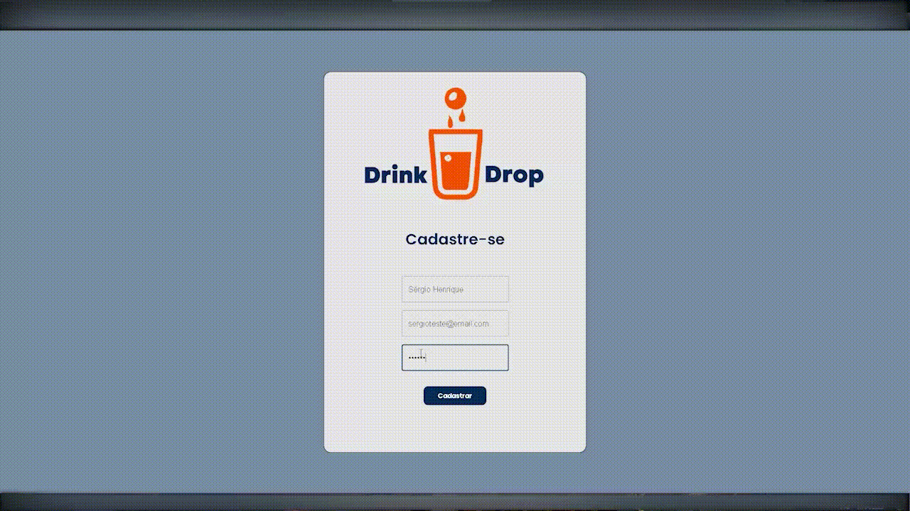

<h1 align="center">🍷  Drink Drop  🛵</h1>

<div align='center'>

</div>

## Description
<p>building</p>

## 💻 Tecnologies used
> [![JavaScript][JavaScript]][JavaScript-url]
[![REACT][REACT]][REACT-url]
[![Node.js][Node.js]][Node.js-url]
[![EXPRESS][EXPRESS]][EXPRESS-url]
[![DOCKER][DOCKER]][DOCKER-url]
[![axios][axios]][axios-url]
[![MYSQL][MYSQL]][MYSQL-url]
[![OOP][OOP]][OOP-url]

## 🛠️ Instructions

### Notes
>The frontend run in port 3000.<br/>
>The backend run in port 3001.<br/>

### 📚 Requirements to run this project:
- Git.
- NPM - v >= 7.0
- Docker


#### <strong>🐳 Run with Docker 🐳</strong>
    
```bash
# Clone the repo
git clone https://github.com/caiobacode/drink-drop-app.git

# Enter in repo
cd drink-drop-app

# Run the front-end
cd ./front-end # enter in front-end folder
npm install # install dependencies
npm start # Run the front-end in port 3000

# Run the back-end
cd ./back-end # enter in back-end folder
npm install # install dependencies
npm run dev # Run the back-end in port 3001

# Run DockerCompose (mysql database)
npm run compose:up

# Go to the backend folder and populate the database.
cd ./back-end
npm run db:reset
```

## 🔎 Additional details

<details>
    <summary><strong>✏️ What i learned</strong></summary>

+ How to do a full stack application from scratch.
+ How work with a five people team.
+ Agile methodologies(Kanban, Scrum).
  
  </details>

<details>
  <summary><strong>👥 Team Members</strong></summary>

- [Gustavo Tardin](https://github.com/GustavoTardin);
- [Matheus Augusto](https://github.com/MatheusAugustoFonseca);
- [Romulo Silva](https://github.com/rromulo);
- [Sérgio Ruza](https://github.com/sergioruza);
  
</details>


[JavaScript]: https://img.shields.io/badge/-JavaScript-F7DF1E?style=for-the-badge&logo=node.js&logoColor=black
[JavaScript-url]: https://www.javascript.com

[REACT]: https://img.shields.io/badge/-React.js-20232A?style=for-the-badge&logo=react
[REACT-url]: https://legacy.reactjs.org/docs/getting-started.html

[Node.js]: https://img.shields.io/badge/-Node.js-80BC02?style=for-the-badge&logo=node.js&logoColor=black
[Node.js-url]: https://nodejs.org/en

[EXPRESS]: https://img.shields.io/badge/Express-111111?style=for-the-badge&logo=express&logoColor=white
[EXPRESS-url]: https://expressjs.com

[MYSQL]: https://img.shields.io/badge/MySQL-00758f?style=for-the-badge&logo=mysql&logoColor=white
[MYSQL-url]: https://www.mysql.com

[DOCKER]: https://img.shields.io/badge/Docker-0db7ed?style=for-the-badge&logo=docker&logoColor=white
[DOCKER-url]: https://www.docker.com

[axios]: https://img.shields.io/badge/axios-5A29E4?style=for-the-badge&logo=axios&logoColor=white
[axios-url]: https://axios-http.com/ptbr/docs/intro

[OOP]: https://img.shields.io/badge/OOP-3a0ca3?style=for-the-badge
[OOP-url]: https://developer.mozilla.org/en-US/docs/Learn/JavaScript/Objects/Object-oriented_programming